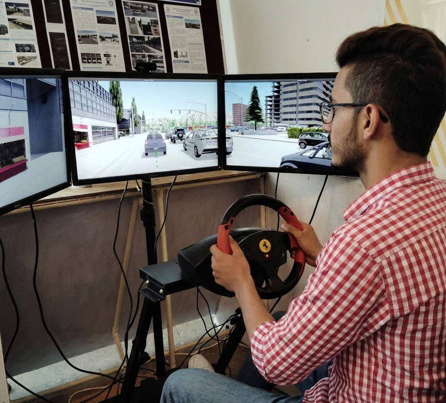

# LLM-based Agent for Driver Sleepiness Detection and Mitigation in Automotive Systems

<div align="center">

[](https://www.python.org/)
[](https://pytorch.org/)
[](https://huggingface.co/meta-llama)
[](https://faiss.ai/)
[](https://huggingface.co/docs/transformers)
[](https://wiki.ros.org/)
[](LICENSE)

</div>

## Project Overview

Driver fatigue is one of the leading causes of road accidents globally, emphasizing the critical need for intelligent systems to detect and mitigate driver sleepiness. This project leverages cutting-edge Large Language Models (LLMs) integrated with multimodal data—including facial expressions, audio signals, driving behavior, and contextual cues—to proactively assess driver alertness levels and deliver intelligent interventions.

<div align="center">
  
  <p><i>Research setup: Driver fatigue detection testing environment using CARLA simulator with steering wheel hardware interface</i></p>
</div>

## Key Objectives

- Develop a robust multimodal feature extraction framework from vision, audio, and driving data
- Integrate multimodal embeddings using Transformer architectures
- Utilize LLMs (LLaMA 2) for intelligent decision-making and personalized interventions
- Evaluate system effectiveness, reliability, and real-world applicability

## System Architecture

### 1. Multimodal Data Fusion
- **Vision Processing:** Facial expression analysis using Vision Transformers and facial landmarks (68-point detection)
- **Audio Processing:** Driver speech and vehicle sounds analyzed via Wav2Vec 2.0 encoders
- **Driving Behavior Analysis:** Vehicle telemetry and lane-keeping patterns using Informer Transformers
- **Cross-modal Integration:** Attention-based fusion mechanisms combining all modalities

### 2. Feature Extraction Pipeline
The system extracts multiple alertness indicators:
- Eye closure duration and blink rate
- Head position and nodding patterns
- Mouth movement and yawning detection
- Voice quality and speech patterns
- Vehicle steering irregularities

### 3. Alertness Assessment
Real-time driver alertness levels are computed through integrated analysis:
- Alert: Full awareness and normal behavior
- Drowsy: Degraded attention, early fatigue signs
- Sleepy: Severe fatigue with immediate intervention needed

### 4. Intelligent Interventions
LLM-based system recommends tailored actions:
- Cabin environment adjustments (temperature, lighting, ventilation)
- Conversation initiation or task engagement
- Rest-stop recommendations and break suggestions
- Emergency protocols if critical fatigue is detected

## Project Structure

```
LLM-based-Agent-for-Driver-Sleepiness-Detection/
│
├── �️  carla_simulator_setup.png            CARLA simulator testing setup image
├── 📝 README.md                             Project documentation
├── 📄 addingthingstoreadme.md               Additional documentation notes
│
├── �📊 input_signal_processing/              Data preprocessing and synchronization
│   ├── 🐍 data_process.py                  Multi-stage data cleaning and normalization
│   ├── 🔄 data_process_only_sync.py        Lightweight synchronization only
│   ├── 📁 src/
│   │   ├── 💾 bag_writer_for_offline_data.py  ROS 2 bag file writer
│   │   ├── ⚙️  preprocess_node.py          ROS 2 preprocessing node
│   │   └── 🔗 sync_node.py                 ROS 2 synchronization node
│   ├── 📄 readme.txt
│   └── 📖 README.md
│
├── 🎥 feature_extraction/                   Multimodal feature extraction pipelines
│   ├── 📹 camera_pipeline.py               Facial feature extraction and landmarks
│   ├── 🏎️  carla_data_feature_extraction.py CARLA simulator data processing
│   ├── 😴 fatigue_estimation.py            Fatigue level computation
│   └── 📖 README.md
│
├── 🔍 vector_database/                      FAISS-based vector storage
│   ├── 🗂️  faiss_vd.py                     Vector database implementation
│   ├── 📄 readme.txt
│   └── 📖 README.md
│
├── 🤖 llm_and_fatigue_handling/             LLM inference and decision-making
│   ├── 🧠 llm_node.py                      Main LLM ROS 2 node
│   ├── 🏷️  generate_fatigue_labels.py      Label generation utility
│   │
│   ├── 🦙 llama2_7B/                       Base LLaMA 2 7B implementation
│   │   ├── 🔮 simple_inference.py          Inference engine
│   │   ├── 📥 simple_input_process.py      Feature preprocessing
│   │   ├── 🎓 simple_fine_tuning_pipeline.py Fine-tuning pipeline
│   │   ├── 🗂️  simple_faiss_vd.py          Vector database integration
│   │   ├── 📊 captured_data.csv            Training dataset
│   │   ├── 📄 readme.txt
│   │   └── 📖 README.md
│   │
│   ├── ⚡ llama2_7B_with_prefix_adapter_vector/  Prefix-tuned adapter variant
│   │   ├── 🔧 model_wrapper_with_mlp_adapter.py  MLP adapter for features
│   │   ├── 🎓 fine_tuning_pipeline.py        Prefix-tuning pipeline
│   │   ├── 📓 inference_v2.ipynb             Inference notebook
│   │   ├── 📥 input_process.py               Feature normalization
│   │   ├── 🗂️  faiss_vd.py                   Vector database integration
│   │   ├── 📊 dummy_data.csv                 Training dataset
│   │   ├── 📄 readme.txt
│   │   └── 📖 README.md
│   │
│   └── 🏃 tiny_llama/                      Lightweight TinyLLaMA variant
│       ├── 📓 tinyllama_inference.ipynb    Inference notebook
│       ├── 🎓 tinyllama_fine_tuning_pipeline.py Fine-tuning pipeline
│       ├── 📥 tinyllama_input_process.py   Feature preprocessing
│       ├── 🗂️  tinyllama_faiss_vd.py       Vector database integration
│       ├── 📊 dummy_data.csv               Training dataset
│       ├── 📄 readme.txt
│       └── 📖 README.md
│
├── 🐳 docker/                               Containerized deployment setup
│   ├── 📦 Dockerfile                       Container build configuration
│   └── 📁 src/
│       └── 🔗 data_sync/                   ROS 2 data synchronization package
│           ├── 🐍 __init__.py
│           ├── 📋 package.xml              ROS 2 package manifest
│           ├── 🔨 CMakeLists.txt
│           ├── 📁 scripts/
│           │   └── 🔗 sync_node.py
│           └── 📁 msg/
│               └── 💬 SyncedOutput.msg
.0
- PyTorch with CUDA acceleration
- PEFT: Parameter-Efficient Fine-Tuning (LoRA, Prefix Tuning)

**Language Models:**
- Meta LLaMA 2 7B as primary inference engine
- TinyLLaMA for resource-constrained scenarios
- BitsAndBytes quantization for efficient memory usage

**Vision Processing:**
- dlib for facial landmark detection
- OpenCV for image preprocessing
- ResNet backbone features

**Vector Database:**
- FAISS (Facebook AI Similarity Search) for embedding storage
- Efficient nearest-neighbor retrieval for context-aware responses

**System Integration:**
- ROS 2 (Robot Operating System) for component communication
- Real-time message passing between processing modules
- Docker containerization for deployment

## Installation & Setup

### Prerequisites
- Python 3.8+
- CUDA 11.0+ (for GPU acceleration)
- ROS 2 (Humble or later)
- 16GB+ RAM (32GB recommended for LLM inference)

### Quick Start

1. Clone the repository:
```bash
git clone <repository-url>
cd LLM-based-Agent-for-Driver-Sleepiness-Detection
```

2. Install Python dependencies:
```bash
pip install -r requirements.txt
```

3. Download LLaMA 2 model (requires Hugging Face access token):
```bash
huggingface-cli login
```

4. Build ROS 2 packages:
```bash
colcon build
```

5. Run the system:
```bash
ros2 launch drowsiness_detection system.launch.py
```

## Module Descriptions

### input_signal_processing
Handles raw data preprocessing and synchronization across multiple sensors. Cleans infrared images, aligns timestamps, and prepares data for feature extraction.

### feature_extraction
Implements computer vision pipelines for:
- Facial action unit detection
- Eye state classification (open/closed)
- Gaze direction estimation
- Head pose estimation
- Audio feature extraction (MFCCs, pitch, energy)
- Driving metric analysis

### vector_database
Maintains a FAISS index for fast retrieval of similar fatigue patterns and contextual examples. Used by LLM for in-context learning and personalized responses.

### llm_and_fatigue_handling
Contains LLM inference nodes with different model variants:
- Standard LLaMA 2 for comprehensive feature analysis
- Prefix-tuned adapter for efficient feature integration
- TinyLLaMA for edge deployment scenarios

## Dataset

The system is trained and evaluated on:
- CARLA simulation environment data
- Real-world driving recordings with synchronized sensors
- Annotated fatigue labels (alert/drowsy/sleepy)
- Manual interventions and outcomes

## Performance Metrics

The system is evaluated on:
- Detection accuracy for fatigue states
- Response latency (real-time capability)
- User satisfaction with intervention relevance
- False positive rate for safety critical applications

## Configuration

Key parameters can be adjusted in configuration files:
- Model IDs and paths for different LLM variants
- Feature extraction thresholds
- Intervention strategies
- ROS 2 topic names and rates

## Docker Deployment

Build and run containerized version:
```bash
cd docker/
docker build -t drowsiness-detection:latest .
docker run -it --gpus all drowsiness-detection:latest
```

## Contributing

This is an active research project. For contributions or issues, please contact the project supervisor.

## Supervisor and Institution

This project was completed as a team project at Technische Hochschule Ingolstadt, Masters Program under the supervision of Prof. Dr. Ignacio Alvarez, Professor für Human-Centered Intelligent Systems.

## License

This project is provided for academic and research purposes.

## Disclaimer

The details provided here are subject to change as the project evolves. Performance in real-world scenarios may vary based on environmental conditions, camera calibration, and individual driver variations. This system is designed as a research prototype and should be integrated with additional safety systems for production use.
